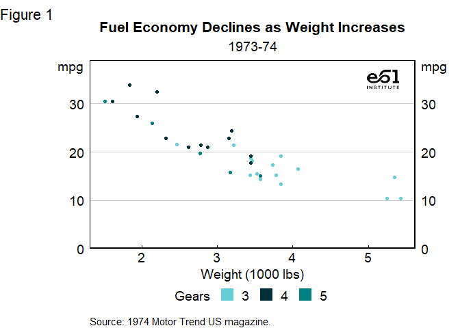
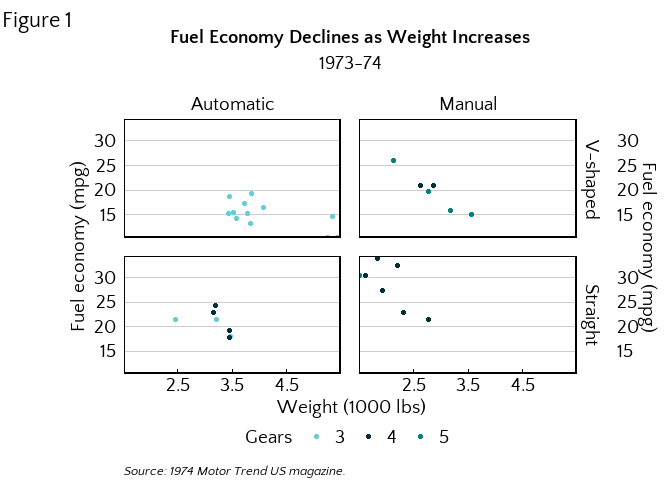
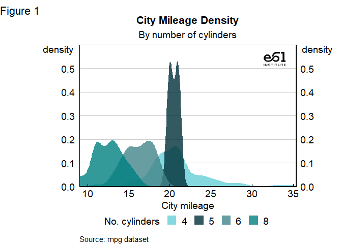
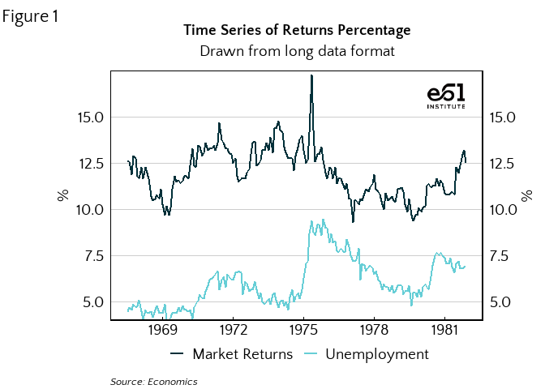
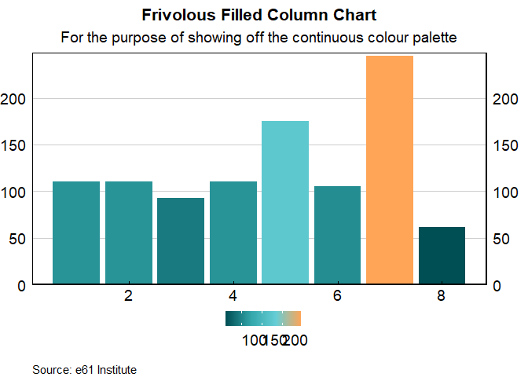

<!-- readme.md is generated by readme.rmd, please edit that document instead -->

# theme61

This package contains functions and colour palettes that enable you to
create e61 Institute themed graphs and know what colours to use in other
applications.

### Installing theme61

If you haven’t already, install the `devtools` package:

`install.packages::devtools()`

Then install from GitHub:

`devtools::install_github("aaronw22/theme61", dependencies = TRUE, upgrade = "always")`

Then load into R:

`library(theme61)`

### Making the best use of the features

For more plotting options, see the vignette (yet to be written).

Use `theme_e61()` to format your graphs in the e61 style.

To use the colour palettes for your graph scales, use
`e61_colour_manual(n=N)` and `e61_fill_manual(n=N)`.

To format continuous scales nicely, use `scale_y_continuous_e61()` and
`scale_x_continuous_e61()`.

To add the e61 logo to the top-right corner of your plot use
`add_e61_logo()`.

### Graph examples

**Scatter graph**

``` r
# Set up data
mtcars2 <- within(mtcars, {
  vs <- factor(vs, labels = c("V-shaped", "Straight"))
  am <- factor(am, labels = c("Automatic", "Manual"))
  cyl  <- factor(cyl)
  gear <- factor(gear)
})

# Graph
p1 <- ggplot(mtcars2) +
  geom_point(aes(x = wt, y = mpg, colour = gear)) +
  labs(
    title = "Fuel Economy Declines as Weight Increases",
    subtitle = "1973-74",
    caption = "Source: 1974 Motor Trend US magazine.",
    tag = "Figure 1",
    x = "Weight (1000 lbs)",
    y = "mpg",
    colour = "Gears"
  )


p1 +
  theme_e61(legend = "bottom", legend_title = TRUE) + 
  scale_y_continuous_e61(limits = c(0, 39)) +
  e61_colour_manual(n = 3) +
  add_e61_logo() + 
  e61_y_title_top(-16) +
  square_legend_symbols()
```

<!-- -->

**Faceted scatter graph**

``` r
p1 +
  facet_grid(vs ~ am) +
  theme_e61(panel_borders = TRUE, legend = "bottom", legend_title = TRUE) +
  e61_y_title_top() +
  e61_colour_manual(n = 3) +
  scale_y_continuous_e61(limits = c(10, 39)) +
  scale_x_continuous_e61()
```

<!-- -->

**Density graph**

``` r
g <- ggplot(mpg, aes(cty))
g + geom_density(aes(fill = factor(cyl)), linetype = "blank", alpha = 0.8) +
  labs(
    title = "City Mileage Density",
    subtitle = "By number of cylinders",
    caption = "Source: mpg dataset",
    x = "City mileage",
    tag = "Figure 1",
    y = "density",
    fill = "No. cylinders"
  ) +
  theme_e61(legend = "bottom", legend_title = TRUE) +
  scale_y_continuous_e61(limits = c(0, 0.6)) +
  scale_x_continuous_e61() +
  e61_y_title_top(-18) +
  e61_fill_manual(n = 4) +
  e61_colour_manual(n = 4) +
  add_e61_logo()
```

<!-- -->

**Line graph**

``` r
df <- economics_long[economics_long$variable %in% c("psavert", "uempmed"), ]

df <- df[lubridate::year(df$date) %in% c(1967:1981), ]

# labels and breaks for X axis text
brks <- df$date[seq(1, length(df$date), 12)]
lbls <- lubridate::year(brks)

# plot
ggplot(df, aes(x = date)) +
  geom_line(aes(y = value, colour = variable), size = 1) +
  labs(
    title = "Time Series of Returns Percentage",
    subtitle = "Drawn from long data format",
    caption = "Source: Economics",
    tag = "Figure 1",
    x = NULL, y = "%",
    colour = NULL
  ) + 
  scale_x_date(date_breaks = "3 years", date_labels = "%Y") +
  scale_y_continuous_e61(limits = c(2.5, 17.5), breaks = seq(2.5, 15, 2.5)) +
  theme_e61(legend = "bottom") +
  e61_y_title_top(-25) +
  e61_colour_manual(n = 2,
                    labels = c("Market Returns", "Unemployment")) +
  add_e61_logo() + 
  square_legend_symbols()
```

<!-- -->

**Column graph**

``` r
col_data <- head(mtcars2, 8)
col_data$names <- rownames(col_data)
col_data$index <- 1:nrow(col_data)

ggplot(col_data, aes(x = index, y = hp, fill = hp)) +
  geom_col() +
  labs(
    title = "Frivolous Filled Column Chart", 
    subtitle = "For the purpose of showing off the continuous colour palette",
    caption = "Source: e61 Institute",
    x = NULL, y = "hp") +
  scale_y_continuous_e61() +
  theme_e61(legend = "bottom") +
  e61_y_title_top(-23, fix_left = 5) +
  e61_fill_manual(discrete = FALSE)
```

<!-- -->
