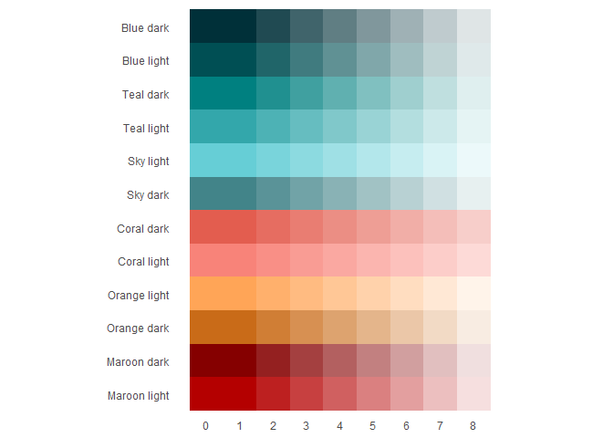

<!-- readme.md is generated by readme.rmd, please edit that document instead -->

# theme61

This package contains functions and colour palettes that enable you to
create e61 Institute themed graphs and know what colours to use in other
applications.

### Installing theme61

If you haven’t already, install the `devtools` package:

`install.packages::devtools()`

Then install from GitHub:

`devtools::install_github("aaronw22/theme61", dependencies = TRUE, upgrade = "always")`

Then load into R:

`library(theme61)`

### Making the best use of the features

See the [package website](https://e61-institute.github.io/theme61/) to
learn how to use the package features.

### Full colour palette

<!-- -->
