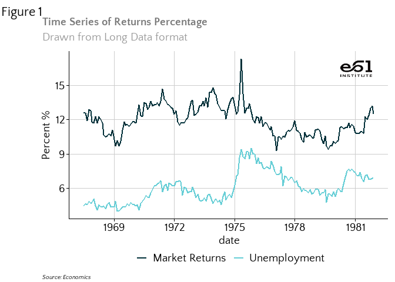

<!-- readme.md is generated by readme.rmd, please edit that document instead -->

# theme61

This package contains functions and colour palettes that enable you to
create e61 Institute themed graphs and know what colours to use in other
applications.

## Quick Start Guide

### Installing theme61

If you havent’t already, install the `devtools` package:

`install.packages::devtools()`

Then install from GitHub:

`devtools::install_github("aaronw22/theme61", dependencies = TRUE, upgrade = "always")`

Then load into R:

`library(theme61)`

### Making the best use of the features

For more plotting options, see the vignette.

Use `theme_e61()` to format the plotting options e61-style.

To use auto colour palettes, use `e61_colour_manual(n=N)` and
`e61_fill_manual(n=N)`.

To add the e61 logo to the top-right corner of your plot use
`add_e61_logo()`

To format continuous scales nicely, use `scale_y_continuous_e61()` and
`scale_x_continuous_e61()`

### Quick Example with time series plot

``` r
library(theme61)
library(ggplot2)
library(lubridate)

df <- economics_long[economics_long$variable %in% c("psavert", "uempmed"), ]

df <- df[lubridate::year(df$date) %in% c(1967:1981), ]

# labels and breaks for X axis text
brks <- df$date[seq(1, length(df$date), 12)]
lbls <- lubridate::year(brks)

# plot
ggplot(df, aes(x=date)) +
  geom_line(aes(y=value, col=variable),size=1) +
  labs(title="Time Series of Returns Percentage",
       subtitle="Drawn from Long Data format",
       caption="Source: Economics",
       tag = "Figure 1",
       y="Percent %",
       color=NULL) +  # title and caption
  scale_x_date(date_breaks = "3 years",date_labels = "%Y")+
  theme_e61(legend = "bottom")+
    e61_colour_manual(n = 2,labels = c("Market Returns", "Unemployment")) +
    add_e61_logo()
```

<!-- -->
