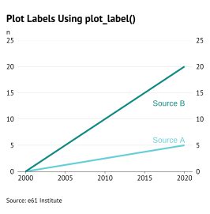
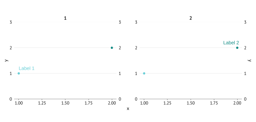
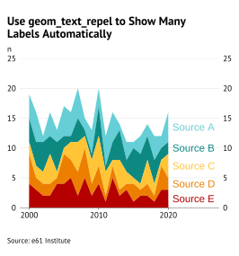

```{r echo = FALSE, message = FALSE, warning = FALSE}
library(ggplot2)
library(ggrepel)
library(data.table)
devtools::load_all()

set.seed(42)

knitr::opts_chunk$set(
  echo = TRUE,
  message = FALSE,
  warning = FALSE,
  collapse = TRUE,
  comment = "#>"
)
```

## Why labels?

Coloured labels placed directly on the plot are better than graph legends when you are making the final, polished version of a graph for presentations, notes and papers for three key reasons.

Labels make it much easier for the reader to identify what group each colour corresponds to, without having to do the rapid eye twitch from the graph to the legend and back again. Repeat this for every group present on the graph and soon you have a recipe for eyestrain.

Labels make more efficient use of the available space on a graph by removing the need to make room for a legend. Legends create unused white space around the legend element and force the plot to be shorter or narrower than it otherwise would be.

Finally, labels are more aesthetic than legends.

## Adding labels with `plot_label()`

The simplest way to add plot labels is to use the `plot_label()` function in `theme61`. The following code provides an example. Most of the code is to set up the mock data and create a graph, the only two lines that are important are the `plot_label()` lines.

`plot_label()` requires you to provide the text of the label (`label`), and the `x` and `y` positioning. For more information, see the documentation (`?plot_label`).

When using this function, make sure the wording of the vector of label names in the label argument are exactly the same as the colour/fill aesthetic being plotted, and the order of the label vector matches the order of the colour/fill aesthetic for the ordering of the colours.  

One way to ensure this is by setting the column in the data to be an ordered factor, and calling the label names using `levels(data$col_name)`.

```{r}
# Mock data
graph_data <- CJ(
  x = 2000:2020,
  source = ordered(c("Source A", "Source B"))
)

graph_data[source == "Source A", y := seq(0, by = 0.25, length = 21)]
graph_data[source == "Source B", y := seq(0, by = 1, length = 21)]

# Graph
graph <- ggplot(graph_data, aes(x, y, colour = source)) +
  geom_line(linewidth = 1) +
  plot_label(
    label = levels(graph_data$source),
    x = c(2016, 2016),
    y = c(6, 13)
  ) +
  labs_e61(
    title = "Plot Labels Using plot_label()",
    sources = c("e61 Institute"),
    x = NULL, y = "n"
  )

save_e61("../man/figures/label-plot-label.svg", graph)


```

## Facets

When you have a facetted graph, you must specify the `facet_name` and `facet_value` arguments in `plot_label()`. 

```{r}
data <- data.frame(
  x = rep(c(1, 2), 2),
  y = rep(c(1, 2), 2),
  f_var = factor(c(1, 1, 2, 2)),
  group = factor(c(1, 2, 1, 2))
)

p1 <- 
  ggplot(data, aes(x, y, colour = group)) +    
  facet_wrap(~f_var) +
  geom_point() +
  scale_y_continuous_e61(c(0, 3, 1)) +
  plot_label(
    label = c("Label 1", "Label 2"),
    x = c(1, 1.85),
    y = c(1.2, 2.2),
    facet_name = "f_var",
    facet_value = "1"
  ) 

save_e61("../man/figures/label-facet-1.svg", p1)

```

If you want to place the labels on different facets, simply supply a vector to `facet_value` with which facet you want each label to appear in.

```{r}
p2 <- ggplot(data, aes(x, y, colour = group)) +
  facet_wrap(~f_var) +
  geom_point() +
  scale_y_continuous_e61(c(0, 3, 1)) +
  plot_label(
    label = c("Label 1", "Label 2"),
    x = c(1, 1.85),
    y = c(1.2, 2.2),
    facet_name = "f_var",
    facet_value = c("1", "2")
  )

save_e61("../man/figures/label-facet-2.svg", p2)



```

## Graphs with many categories

Sometimes you have many categories, far too many to want to plot manually even with the `data.frame` approach. If you are willing to sacrifice the ability to specify the exact location of each label, you could use `geom_text_repel()` to add appropriately coloured text labels for each colour/fill aesthetic. 

```{r}
# Mock data
graph_data <- CJ(
  year = 2000:2020,
  source = paste("Source", LETTERS[1:5])
)
graph_data[, value := sample(5, nrow(graph_data), replace = TRUE)]

# Graph
graph <- ggplot(graph_data, aes(x = year, y = value, fill = source)) +
  geom_area(linewidth = 1) +
                  # We only need one label for each group, ideally on the far 
                  # right of the graph, so we keep the last year only
  geom_text_repel(data = graph_data[year == max(year)],
                  aes(x = year, y = value, label = source, colour = source),
                  # This forces the text to appear further right than 2020
                  xlim = c(2020, NA),
                  # This moves the vertical position of the label downwards
                  position = position_stack(vjust = 0.5),
                  # This hides the line that joins the label to the graph element
                  segment.color = NA,
                  size = 4) +
  # Extends the right-side of the graph to create room for the labels
  scale_x_continuous(limits = c(NA, 2026)) +
  scale_colour_e61() +
  labs_e61(
    title = "Use geom_text_repel to Show Many Labels Automatically",
    sources = c("e61 Institute"),
    x = NULL, y = "n"
  )

save_e61("../man/figures/label-cats.svg", graph)


```
