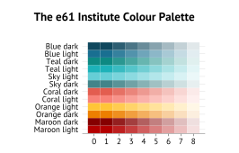
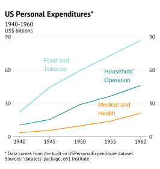
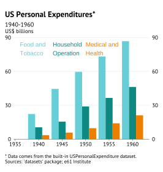
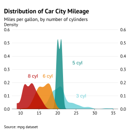
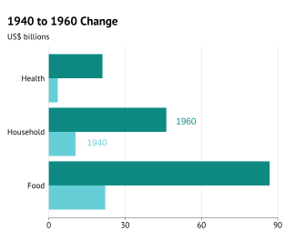
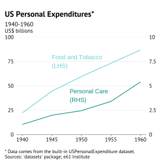
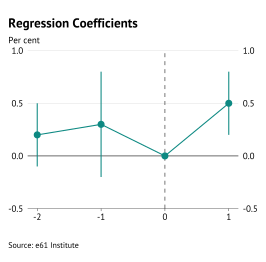
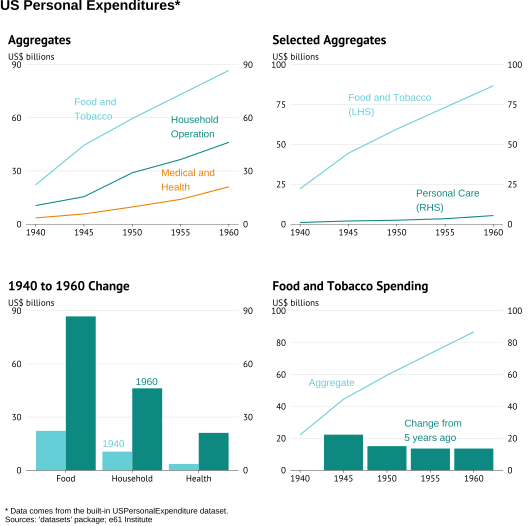

```{r echo = FALSE, message = FALSE, warning = FALSE}
library(ggplot2)
library(data.table)
devtools::load_all()

knitr::opts_chunk$set(
  echo = TRUE,
  message = FALSE,
  warning = FALSE,
  collapse = TRUE,
  comment = "#>",
  fig.align = 'center', 
  out.width = '60%'
)

# No annoying messages
options(no_advisory = TRUE)

# Prep data: US personal expenditure aggregates in US$b
data <- USPersonalExpenditure
data <- as.data.table(data, keep.rownames = TRUE)
data <- melt(data, id.vars = "rn", variable.name = "year", value.name = "value")
setnames(data, "rn", "category")
data[, category := factor(category)]
data[, year := as.numeric(as.character(year))]

# 3 main categories
data_3 <- data[category %in% c("Food and Tobacco", "Household Operation", "Medical and Health")]

# Dual axis graph data
data_dual <- data[category %in% c("Food and Tobacco", "Personal Care")]
data_dual <- dcast(data_dual, year ~ category, value.var = "value")

# Column graph data
data_col <- data[year %in% c(1940, 1960) & category %in% c("Food and Tobacco", "Household Operation", "Medical and Health")]
data_col[, category := factor(category, 
                              c("Food and Tobacco", "Household Operation", "Medical and Health"),
                              c("Food", "Household", "Health"))]

# Change data
data_chg <- copy(data)[, change := value - shift(value), by = category]

# Point range data
pt_rg_data <- data.table(x = -2:1, 
                         ymin = c(-0.1, -0.2, 0, 0.2), 
                         y = c(0.2, 0.3, 0, 0.5), 
                         ymax = c(0.5, 0.8, 0, 0.8))

```

## Introduction

`theme61` is e61 Institute's graphing package for producing graphs that abide by our in-house standards. It works by changing the appearance and functionality of graphs produced using the `ggplot2` package.

You should read this article to help you understand how to create graphs following our graph standards.

This article provides some examples to help you figure out what elements you can change. The function documentation provides comprehensive information on the full customisability of the package.

## Correct workflow

When making graphs, you should follow the below workflow. 

Save your graph using `save_e61()`. Do **not** use the Export button in the Plots tab or `ggsave()`.

Start by creating a graph using the 'normal' stuff: `ggplot(data, aes(x, y)) + geom_blah()`. Then:

- Add plot labelling: `plot_label()`
- Add titles, axes labels, footnotes and sources: `labs_e61(title = "Title", subtitle = "Subtitle", footnotes = "Footnotes", sources = c("Source 1", "Source 2"), y = "%")`
- (optional) Use `theme_e61()` if you want to add a legend, or change its position. Other aspects of `theme_e61()` are now added by default. 
- (optional) Format the x and y axes scales: `scale_y_continuous_e61()`, `scale_x_continuous_e61()`. Your y-axis will be automatically scaled when you save your chart using `save_e61()` but if you do not like the automatic scaling then you can always scale your axes manually.
- Save the graph: `save_e61()`.

## The colour palette

This is the e61 Institute colour palette. 

All the colours are package objects that can be selected by using the appropriate name. For example, `e61_tealdark3` selects the colour 'Teal dark' with the shade in column '3'.

```{r theme61-colours, echo = FALSE}
source("colour-palette.R")

```

## Graph examples

### Line graph {#line}

```{r}
g <- ggplot(data_3, aes(x = year, y = value, colour = category)) + 
  geom_line() +
  plot_label(c("Food and\nTobacco", "Household\nOperation", "Medical and\nHealth"),
              c(1944, 1954, 1953),
              c(65, 55, 25)) +
  labs_e61(
    title = "US Personal Expenditures*",
    subtitle = "1940-1960",
    footnotes = "Data comes from the built-in USPersonalExpenditure dataset.",
    sources = c("e61 Institute", "'datasets' package"),
    y = "$b"
  )
save_e61("../man/figures/g-line.svg")
```

```{r, echo=FALSE}

```

### Column graph {#column}

```{r}
g <- ggplot(data_3, aes(x = year, y = value, fill = category)) + 
  geom_col(position = "dodge") +
  plot_label(c("Food and\nTobacco", "Household\nOperation", "Medical and\nHealth"),
              c(1936, 1943, 1950),
              c(80, 80, 80)) +
  labs_e61(
    title = "US Personal Expenditures*",
    subtitle = "1940-1960",
    footnotes = "Data comes from the built-in USPersonalExpenditure dataset.",
    sources = c("e61 Institute", "'datasets' package"),
    y = "$b"
  )

save_e61("../man/figures/g-col.svg")

```

```{r, echo=FALSE}

```

### Scatter graph {#scatter}

```{r}

# Set up data
mtcars2 <- within(mtcars, {
  vs <- factor(vs, labels = c("V-shaped", "Straight"))
  am <- factor(am, labels = c("Automatic", "Manual"))
  cyl  <- factor(cyl)
  gear <- factor(gear)
})

# Graph
g <- ggplot(mtcars2, aes(x = wt, y = mpg, colour = gear)) +
  geom_point() +
  plot_label(
    label = c("3 cyl", "4 cyl", "5 cyl"),
    x = c(4, 2.7, 2.5),
    y = c(23, 35, 15)
  ) +
  labs_e61(
    title = "Car Fuel Efficiency and Weight",
    subtitle = "Data from 1973-74",
    sources = "1974 Motor Trend US magazine",
    x = "Weight (1000 lbs)",
    y = "mpg"
  )

save_e61("../man/figures/g-scatter.svg")
```

```{r, echo=FALSE}

```

### Faceted scatter graph {#facet}

```{r}
g <- ggplot(mtcars2, aes(x = wt, y = mpg)) +
  facet_grid(vs ~ am) +
  geom_point() +
  labs_e61(
    title = "Car Fuel Efficiency and Weight",
    subtitle = "Data from 1973-74",
    sources = "1974 Motor Trend US magazine",
    x = "Weight (1000 lbs)",
    y = "mpg"
  )

save_e61("../man/figures/g-facet.svg")
```

```{r, echo=FALSE, out.width='100%'}
knitr::include_graphics("../man/figures/g-facet.svg")
```

### Density graph {#density}

```{r}
g <- ggplot(mpg, aes(x = cty, fill = factor(cyl))) + 
  geom_density(linetype = "blank", alpha = 0.8) +
  labs_e61(
    title = "Distribution of Car City Mileage",
    subtitle = "Miles per gallon, by number of cylinders",
    sources = "mpg dataset",
    y = "dens",
  ) +
  plot_label(label = c("3 cyl", "5 cyl", "6 cyl", "8 cyl"),
              x = c(25, 24, 16, 12),
              y = c(0.1, 0.35, 0.25, 0.25)) +
  scale_y_continuous_e61()

save_e61("../man/figures/g-dens.svg")
```

```{r, echo=FALSE}

```

### Horizontal bar graph {#flippedbar}

```{r}
g <- ggplot(data_col, aes(x = category, y = value, fill = factor(year))) +
  geom_col(position = "dodge") +
  coord_flip() +
  plot_label(c("1940", "1960"),
              c(1.8, 2.2),
              c(15, 50)) +
  labs_e61(
    title = "1940 to 1960 Change", 
    y = "$b"
  ) +
  format_flip()

save_e61("../man/figures/g-flip.svg")
```

```{r, echo=FALSE}

```

### Rescaled secondary axis graph {#secaxis}

Note: Admittedly this feature is somewhat advanced/fiddly.

Despite [Hadley's best efforts](https://stackoverflow.com/questions/3099219/ggplot-with-2-y-axes-on-each-side-and-different-scales/3101876#3101876) to make it difficult to add a differently-scaled second y-axis, this feature now exists in `theme61.`

Implementing dual y-axis requires a fair amount of additional faff that I will try and step through.

First, the structure of your data needs to be different to the usual best practice. Normally, you want your data in long format, and add separate groups using `colour` or `fill`. However, if you want one of the lines on the secondary axis, each series needs to be in its own column. 

Each series will also be plotted separately with its own `geom_line()` (or any other `geom_` depending on what you want to plot obviously), as in the example below.

You need to then transform the `y` aesthetic in the series to be plotted on the secondary axis using the `sec_rescale_inv()` function (see the documentation for the required arguments).

You also need to manually specify the colour to colour in the lines, using `palette_e61()`.

You must then specify the `sec_axis` argument in `scale_y_continuous_e61()` with `sec_axis(~sec_rescale(.), name = "name")`. Replace "name" with the y-axis label. This must be specified otherwise it will show up blank.

You also need to set `rescale_sec = TRUE` to ensure the formatting is appropriately adjusted for the secondary axis.

Finally, you will need to run your code twice, as the first time, there will be an error caused by how R internally assigns objects generated by simultaneous function calls (this may get fixed in the future). 

```{r, include=F, echo=F}
# This chunk only exists because of the weird run twice bug
ggplot(data_dual, aes(x = year)) +
  geom_line(aes(y = `Food and Tobacco`), colour = palette_e61(2)[[1]]) +
  # All the action is in the next 5 lines
  geom_line(aes(y = sec_rescale_inv(`Personal Care`, scale = 0.1, shift = 0)),
            colour = palette_e61(2)[[2]]) +
  scale_y_continuous_e61(limits = c(0, 100, 25), name = "$b",
                         # Usually you don't need to supply scale and shift again but to get the vignette to run you do here
                         sec_axis = sec_axis(~sec_rescale(., scale = 0.1, shift = 0), name = "$b"),
                         rescale_sec = TRUE)
```

```{r}
g <- ggplot(data_dual, aes(x = year)) + 
  geom_line(aes(y = `Food and Tobacco`), colour = palette_e61(2)[[1]]) +
  # All the action is in the next 5 lines
  geom_line(aes(y = sec_rescale_inv(`Personal Care`, scale = 0.1, shift = 0)), 
            colour = palette_e61(2)[[2]]) +
  scale_y_continuous_e61(limits = c(0, 100, 25), name = "$b",
                         # Usually you don't need to supply scale and shift again but to get the vignette to run you do here
                         sec_axis = sec_axis(~sec_rescale(., scale = 0.1, shift = 0), name = "$b"), 
                         rescale_sec = TRUE) +
  plot_label(c("Food and Tobacco\n(LHS)", "Personal Care\n(RHS)"),
              c(1945, 1948),
              c(75, 40)) +
  labs_e61(
    title = "US Personal Expenditures*",
    subtitle = "1940-1960",
    footnotes = "Data comes from the built-in USPersonalExpenditure dataset.",
    sources = c("e61 Institute", "'datasets' package"),
    y = "$b"
  )

```

```{r, echo=FALSE}
save_e61("../man/figures/g-dual.svg")

```

### Point range graph {#ptrange}

`geom_pointrange()` is useful for plotting regression coefficients. If you are plotting coefficients over time, e.g. for an event study, including a `geom_line()` can also help show the passage of time.

```{r}
g <- ggplot(pt_rg_data, aes(x, y, ymin = ymin, ymax = ymax)) + 
  geom_vline(xintercept = 0, linetype = 2, linewidth = 0.25) +
  add_baseline() +
  geom_pointrange(colour = e61_tealdark) +
  geom_line(colour = e61_tealdark) +
  labs_e61(
    title = "Regression Coefficients",
    sources = c("e61 Institute"),
    y = "%"
  )
save_e61("../man/figures/g-ptrg.svg")
```

```{r, echo=FALSE}

```


### Multi-panel graph {#mpanel}

We have discovered in our research notes that putting multiple graphs together in a grid/panel works quite well with the format.

Note that graph titles need to be done differently in multi-panels. Individual panels should not have sources or footnotes, they should be in the footer of the full multi-panel instead.

First we make the sub-plots as their own graph.

```{r}
g1 <-
  ggplot(data_3, aes(x = year, y = value, colour = category)) +
  geom_line() +
  plot_label(c("Food and\nTobacco", "Household\nOperation", "Medical and\nHealth"),
              c(1944, 1954, 1953),
              c(65, 55, 25)) +
  labs_e61(
    title = "Aggregates",
    y = "$b"
  )

g2 <- ggplot(data_dual, aes(x = year)) +
    geom_line(aes(y = `Food and Tobacco`), colour = palette_e61(2)[[1]]) +
    geom_line(aes(y = `Personal Care`), colour = palette_e61(2)[[2]]) +
    scale_y_continuous_e61(limits = c(0, 100, 25)) +
  plot_label(
    c("Food and Tobacco\n(LHS)", "Personal Care\n(RHS)"),
    c(1945, 1952),
    c(75, 15)
  ) +
  labs_e61(
    title = "Selected Aggregates",
    y = "$b"
  )

g3 <-
  ggplot(data_col, aes(x = category, y = value, fill = factor(year))) +
  geom_col(position = "dodge") +
  plot_label(c("1940", "1960"),
              c(1.55, 2.05),
              c(15, 50)) +
  labs_e61(
    title = "1940 to 1960 Change", 
    y = "$b"
  )

g4 <- 
  ggplot(data_chg[category == "Food and Tobacco"], aes(x = year)) +
  geom_line(aes(y = value), colour = palette_e61(2)[[1]]) +
  geom_col(aes(y = change), fill = palette_e61(2)[[2]]) +
  scale_y_continuous_e61(limits = c(0, 100, 20)) +
  plot_label(
    c("Aggregate", "Change from\n5 years ago"),
    c(1941, 1952),
    c(55, 25)
  ) +
  labs_e61(
    title = "Food and Tobacco Spending", 
    y = "$b"
  )
```

Then we use `save_e61()` to put the graphs together.

```{r}
save_e61(
    g1, g2, g3, g4,
    filename = "../man/figures/g-multi.svg",
    title = "US Personal Expenditures*",
    footnotes = "Data comes from the built-in USPersonalExpenditure dataset.",
    sources = c("e61 Institute", "'datasets' package")
)
```

```{r, echo=FALSE, out.width='100%'}

```
